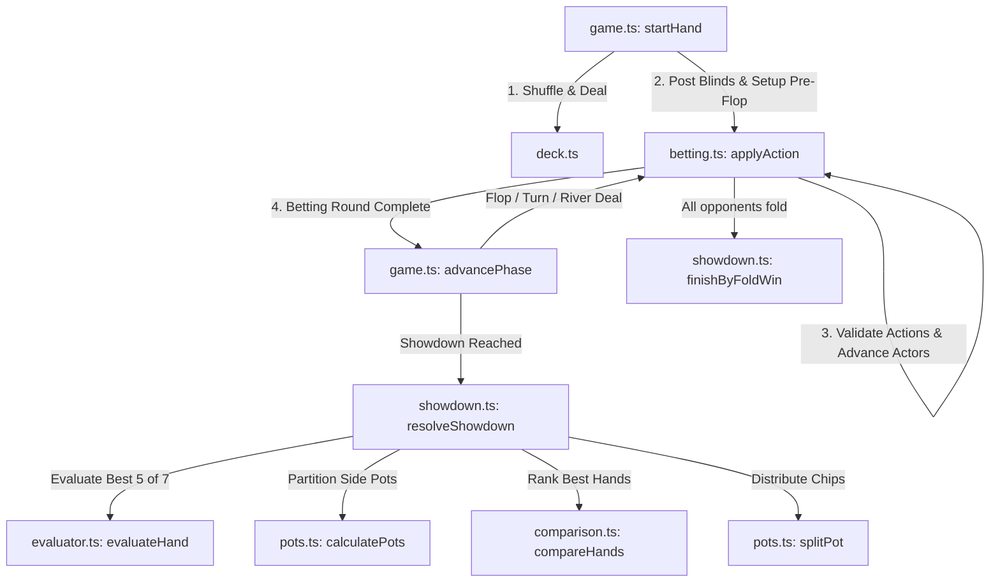
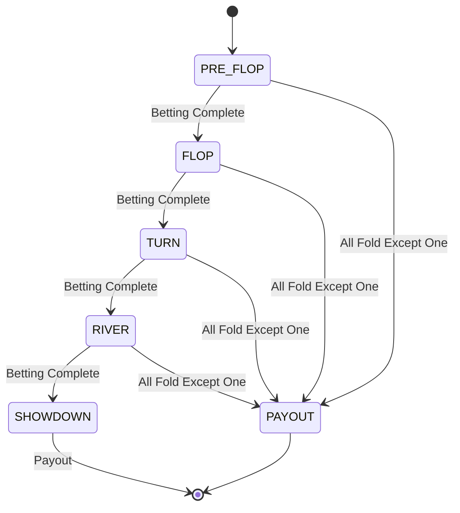
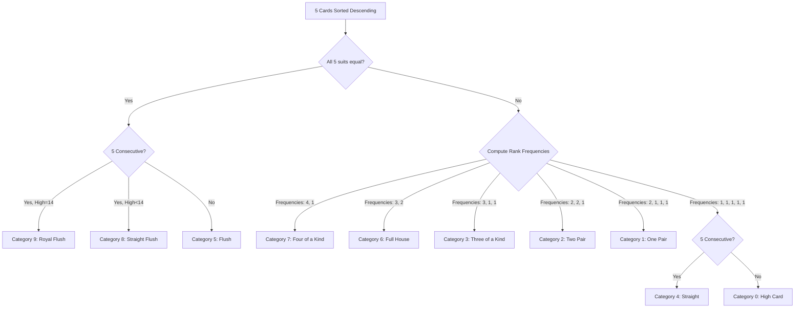
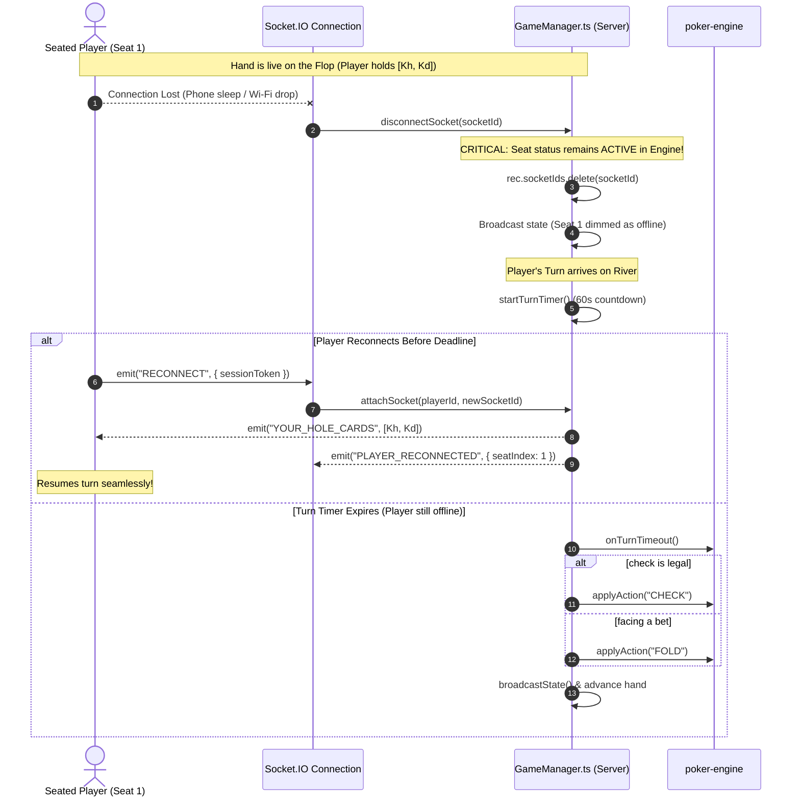

# Texas Hold'em Poker Engine Specification & Architecture

This document provides a comprehensive technical walkthrough of the server-authoritative Texas Hold'em Poker Engine implemented in [`packages/poker-engine`](file:///d:/poker-game-phase1/poker-game/packages/poker-engine) and its server lifecycle integration in [`apps/server`](file:///d:/poker-game-phase1/poker-game/apps/server).

---

## Table of Contents
1. [Overview & Architectural Principles](#1-overview--architectural-principles)
2. [Module Map & File Organization](#2-module-map--file-organization)
3. [Data Structures & Type System](#3-data-structures--type-system)
4. [Deck Lifecycle & Uniform Shuffling](#4-deck-lifecycle--uniform-shuffling)
5. [Table & Hand Lifecycle](#5-table--hand-lifecycle)
6. [Betting Round State Machine](#6-betting-round-state-machine)
7. [Hand Evaluation & Tiebreaking Algorithm](#7-hand-evaluation--tiebreaking-algorithm)
8. [Side Pot Level Algorithm & Odd-Chip Splitting](#8-side-pot-level-algorithm--odd-chip-splitting)
9. [Showdown & Fold-Win Resolution](#9-showdown--fold-win-resolution)
10. [Step-by-Step Scenario Walkthrough](#10-step-by-step-scenario-walkthrough)
11. [Core Invariants & Mathematical Guarantees](#11-core-invariants--mathematical-guarantees)
12. [Disconnection Handling, Session Tokens & Engine Isolation](#12-disconnection-handling-session-tokens--engine-isolation)

---

## 1. Overview & Architectural Principles

The Poker Engine is designed around four foundational principles:
1. **Server Authoritative & Zero-Trust**: All cards are dealt, held, and evaluated on the server. Clients receive only their own hole cards until showdown.
2. **Pure & Functional Core**: The engine functions are deterministic and stateless. Given `(state, action) -> newState`, transitions never rely on side-effects or external network I/O.
3. **Strict Chip Conservation**: Total table chips before a hand strictly equal total table chips after payouts.
4. **Standard No-Limit Hold'em Rules**: Strict adherence to WSOP / TDA rules, including the Full Raise Rule, Under-Raise protections, the A-2-3-4-5 Wheel straight, uncalled bet refunds, and the clockwise odd-chip rule.

---

## 2. Module Map & File Organization

```
packages/poker-engine/src/
├── deck.ts         # 52-card standard deck creation, Fisher-Yates shuffle, dealing
├── evaluator.ts    # 7-card combination generation, 5-card evaluation, Wheel straight logic
├── comparison.ts   # EvaluatedHand lexicographical comparator
├── betting.ts      # Betting round state machine, legality, full-raise rule & refunds
├── pots.ts         # Level-based side pot algorithm & odd-chip remainder distribution
├── showdown.ts     # Payout resolution across main/side pots & uncontested fold-wins
├── game.ts         # Table state, dealer rotation, heads-up/multi-way blinds & street advancement
└── index.ts        # Public API exports
```



---

## 3. Data Structures & Type System

### Card Model (`card.ts`)
```typescript
export type Suit = "SPADES" | "HEARTS" | "DIAMONDS" | "CLUBS";
export type Rank = 2 | 3 | 4 | 5 | 6 | 7 | 8 | 9 | 10 | 11 | 12 | 13 | 14;

export interface Card {
  rank: Rank; // 14 = Ace, 13 = King, ..., 2 = Two
  suit: Suit;
}
```

### Hand Categories & Evaluated Result (`hand.ts`)
```typescript
export enum HandCategory {
  HIGH_CARD = 0,
  ONE_PAIR = 1,
  TWO_PAIR = 2,
  THREE_OF_A_KIND = 3,
  STRAIGHT = 4,
  FLUSH = 5,
  FULL_HOUSE = 6,
  FOUR_OF_A_KIND = 7,
  STRAIGHT_FLUSH = 8,
  ROYAL_FLUSH = 9,
}

export interface EvaluatedHand {
  category: HandCategory;
  rankValues: number[]; // Ordered tie-breaking ranks (e.g. [13, 9, 14] for KK99A)
  bestFive: Card[];     // The exact 5 cards forming the hand
}
```

### Seat & Table State (`game.ts`)
```typescript
export interface Seat {
  seatIndex: number;              // 0-9
  playerId: string | null;
  username: string | null;
  avatar?: number;                // 1-10
  coins: number;                  // Current chip stack
  currentBetThisRound: number;    // Chips committed in current street
  totalInvestedThisHand: number;  // Total chips committed across all streets
  status: "EMPTY" | "SITTING_OUT" | "ACTIVE" | "FOLDED" | "ALL_IN" | "DISCONNECTED" | "BUSTED";
  isDealer: boolean;
  isSmallBlind: boolean;
  isBigBlind: boolean;
  holeCards: Card[] | null;       // Private to this seat
  debtTo?: Record<string, number>;
  preAction?: "CHECK" | "FOLD" | null;
}

export interface TableState {
  seats: Seat[];
  phase: GamePhase;
  handNumber: number;
  dealerSeatIndex: number | null;
  deck: Card[];
  communityCards: Card[];
  pot: number;
  pots: Pot[];
  currentBet: number;
  minRaiseIncrement: number;
  actingSeatIndex: number | null;
  actedThisRound: boolean[];
  mayRaise: boolean[];
  smallBlind: number;
  bigBlind: number;
  lastAction: { seatIndex: number; action: PlayerAction; amount?: number } | null;
}
```

---

## 4. Deck Lifecycle & Uniform Shuffling

### 1. 52-Card Deck Creation (`createDeck`)
A fresh 52-card array is constructed by taking the Cartesian product of the 4 suits and 13 ranks:
$$\text{Deck} = \{ (r, s) \mid r \in [2, 14], s \in \{\text{SPADES, HEARTS, DIAMONDS, CLUBS}\} \}$$

### 2. Fisher-Yates Uniform Shuffle (`shuffleDeck`)
To ensure an unbiased random permutation where every one of the $52! \approx 8.0658 \times 10^{67}$ orderings is equally likely:
```typescript
export function shuffleDeck(deck: Card[]): Card[] {
  const d = [...deck];
  for (let i = d.length - 1; i > 0; i--) {
    const j = Math.floor(Math.random() * (i + 1));
    [d[i], d[j]] = [d[j]!, d[i]!];
  }
  return d;
}
```

### 3. Dealing Mechanics (`dealCards`)
Dealing removes $n$ cards from the front of the remaining deck array:
- **Pre-Flop**: 2 hole cards per player, dealt 1 card per pass clockwise starting from the Small Blind.
- **Flop**: 3 cards dealt to `communityCards`.
- **Turn**: 1 card dealt to `communityCards`.
- **River**: 1 card dealt to `communityCards`.

---

## 5. Table & Hand Lifecycle

### 1. Button Movement & Blind Assignments (`game.ts`)
When `startHand` is invoked:
1. The button advances clockwise to the next **occupied** seat with chips (`rotateDealer`).
2. Statuses are normalized (`SITTING_OUT`, `FOLDED`, and `ALL_IN` seats with chips are promoted to `ACTIVE`).
3. Positions and blinds are assigned:

| Mode | Eligible Seats | Dealer Button | Small Blind (SB) | Big Blind (BB) | Pre-Flop 1st Actor | Post-Flop 1st Actor |
| :--- | :--- | :--- | :--- | :--- | :--- | :--- |
| **Heads-Up** | Exactly 2 | Button | **Button (Dealer)** | Opponent | **Button (Dealer/SB)** | Opponent (BB) |
| **Multi-Way** | 3 to 10 | Button | Next clockwise from Button | 2nd clockwise from Button | Under the Gun (Seat after BB) | 1st active clockwise from Button |

### 2. Blind Posting Logic
```typescript
function postBlind(t: TableState, seat: Seat, blindAmount: number): void {
  const pay = Math.min(blindAmount, seat.coins);
  seat.coins -= pay;
  seat.currentBetThisRound += pay;
  seat.totalInvestedThisHand += pay;
  if (seat.coins === 0 && seat.status === "ACTIVE") seat.status = "ALL_IN";
}
```
- Even if the Big Blind poster is short (e.g. holds 8 chips when BB is 20), `table.currentBet` is set to the full big blind (`20`).

---

## 6. Betting Round State Machine



### 1. Action Legality Calculation (`getLegalActions` in `betting.ts`)
- **`callAmount = max(0, currentBet - seat.currentBetThisRound)`**
- **`maxRaiseTo = seat.currentBetThisRound + seat.coins`**
- **`minRaiseTo = min(currentBet + minRaiseIncrement, maxRaiseTo)`**

| Condition | Legal Actions |
| :--- | :--- |
| `callAmount === 0` | `CHECK`, `BET` (if `coins > 0`), `ALL_IN`, `FOLD` |
| `callAmount > 0` | `CALL`, `RAISE` (if `coins > callAmount` and `mayRaise === true`), `ALL_IN`, `FOLD` |

### 2. Raise-TO vs. Raise-BY Semantics
All raise and bet actions specify the **total chips committed by that player in the current round** (`raise-TO`):
- If `currentBet === 20` and a player wants to raise by `40`, they submit `RAISE 60`.

### 3. The Full Raise Rule vs. Short All-In Under-Raise
- **Full Raise**: If `amount >= currentBet + minRaiseIncrement`:
  - `minRaiseIncrement` updates to `amount - currentBet`.
  - Action is re-opened for all other active players (`mayRaise = true`, `actedThisRound = false`).
- **Short All-In Under-Raise**: If a player goes All-In for less than the full minimum raise (`amount < currentBet + minRaiseIncrement`):
  - `minRaiseIncrement` remains unchanged.
  - Action is **not** reopened for players who already acted (`mayRaise` set to `false`). They may only call the shortfall or fold.

### 4. Uncalled Bet Refund Algorithm (`computeUncalledRefund`)
When a betting round ends, if the highest bet exceeds the second-highest bet, the excess was never called and must be refunded before pots are calculated:
```typescript
export function computeUncalledRefund(
  seats: Seat[],
  currentBet: number
): { seatIndex: number; amount: number } | null {
  let top = -1, second = -1, topSeat = -1;
  for (const s of seats) {
    const b = s.currentBetThisRound;
    if (b > top) {
      second = top;
      top = b;
      topSeat = s.seatIndex;
    } else if (b > second) {
      second = b;
    }
  }
  if (top > 0 && top > second) {
    return { seatIndex: topSeat, amount: top - second };
  }
  return null;
}
```

---

## 7. Hand Evaluation & Tiebreaking Algorithm

### 1. 7-Choose-5 Combination Generation (`evaluator.ts`)
From the 7 available cards (2 hole + 5 community), there are $\binom{7}{5} = 21$ possible 5-card combinations:
$$\binom{7}{5} = \frac{7!}{5!(7-5)!} = 21$$
The engine generates all 21 combinations using recursive backtracking and evaluates each.

### 2. Hand Evaluation Hierarchy (`evaluateFiveCardHand`)



### 3. The A-2-3-4-5 "Wheel" Straight Rule
When checking for straights, Ace ($14$) can act as high (above King) or low (below Two):
```typescript
function findStraightHigh(uniqueRanksDesc: number[]): number | null {
  const ranksForWheelCheck = uniqueRanksDesc.includes(14)
    ? [...uniqueRanksDesc, 1] // Treat Ace as 1
    : uniqueRanksDesc;

  for (let i = 0; i <= ranksForWheelCheck.length - 5; i++) {
    let isConsecutive = true;
    for (let j = 0; j < 4; j++) {
      if (ranksForWheelCheck[i + j]! - ranksForWheelCheck[i + j + 1]! !== 1) {
        isConsecutive = false;
        break;
      }
    }
    if (isConsecutive) return ranksForWheelCheck[i]!;
  }
  return null;
}
```
- For $A\text{-}2\text{-}3\text{-}4\text{-}5$, the straight high is **$5$** (`rankValues = [5]`), which naturally loses to a 6-high straight ($2\text{-}3\text{-}4\text{-}5\text{-}6$).

### 4. Lexicographical Comparator (`comparison.ts`)
```typescript
export function compareHands(a: EvaluatedHand, b: EvaluatedHand): number {
  if (a.category !== b.category) return a.category - b.category;
  for (let i = 0; i < Math.max(a.rankValues.length, b.rankValues.length); i++) {
    const av = a.rankValues[i] ?? 0;
    const bv = b.rankValues[i] ?? 0;
    if (av !== bv) return av - bv;
  }
  return 0; // Absolute tie
}
```

---

## 8. Side Pot Level Algorithm & Odd-Chip Splitting

### 1. Level-Based Side Pot Calculation (`pots.ts`)
When multiple players go all-in for different amounts, pots are computed using commitment levels:

1. Identify all active/all-in players who contributed chips (**contenders**).
2. Extract and sort their unique total investment amounts:
   $$\text{levels} = [L_1, L_2, \dots, L_k] \quad \text{where } L_1 < L_2 < \dots < L_k$$
3. For each level $L_j$ (starting with $L_0 = 0$):
   $$\text{PotAmount}_j = \sum_{s \in \text{All Seats}} \left( \min(s.\text{invested}, L_j) - \min(s.\text{invested}, L_{j-1}) \right)$$
   $$\text{EligibleSeats}_j = \{ s \in \text{Contenders} \mid s.\text{invested} \ge L_j \}$$
4. **Dead Money**: Folded players contribute chips up to their fold level into the pot amounts, but are omitted from `EligibleSeats`.

### 2. Odd-Chip Splitting Rule (`splitPot`)
When a pot cannot be divided evenly among $N$ tied winners:
$$\text{BaseShare} = \lfloor \text{PotAmount} / N \rfloor, \quad \text{Remainder} = \text{PotAmount} \pmod N$$
The remainder chips are awarded one chip at a time to tied players in **clockwise order starting from the seat immediately left of the dealer button**.

```typescript
const distanceFromButton = (seatIndex: number): number =>
  (((seatIndex - dealerSeatIndex - 1) % totalSeats) + totalSeats) % totalSeats;
```

---

## 9. Showdown & Fold-Win Resolution

### Showdown Sequence (`resolveShowdown` in `showdown.ts`)
1. Compute all side pots from total player investments.
2. Evaluate the best 5-card hand for every non-folded player.
3. For each pot (from Main Pot to successive Side Pots):
   - Filter eligible hands.
   - Find the highest-ranking hand using `compareHands`.
   - Distribute chips using `splitPot`.
4. Return updated seat balances, awarded pots, and showdown results.

### Uncontested Fold-Win (`finishByFoldWin`)
If all opponents fold:
1. Any uncalled portion of the winner's current round bet is refunded.
2. All remaining bets sweep into the pot.
3. The winner receives the pot **without exposing their hole cards**.

---

## 10. Step-by-Step Scenario Walkthrough

### Scenario: 3-Way All-In with Side Pots

#### Players & Chip Stacks
- **Seat 0 (Player A)**: 100 chips (Small Blind = 10)
- **Seat 1 (Player B)**: 250 chips (Big Blind = 20)
- **Seat 2 (Player C)**: 600 chips (Button)
- **Seat 3 (Player D)**: 50 chips (Folded pre-flop after posting 50)

#### Pre-Flop Action:
1. **Player C** raises to 500.
2. **Player D** calls 50 and then folds.
3. **Player A** goes All-In for 100 total.
4. **Player B** goes All-In for 250 total.
5. Betting completes:
   - Player C invested 500, but the second-highest bet is 250 (Player B).
   - **Uncalled refund**: $500 - 250 = 250$ returned to Player C immediately.
   - Live investments: Player A = 100, Player B = 250, Player C = 250, Player D (folded) = 50.

#### Side Pot Calculation:
- **Unique levels**: $L_1 = 100, L_2 = 250$.

$$\begin{aligned}
\text{Main Pot } (0 \to 100): &\quad 100(\text{A}) + 100(\text{B}) + 100(\text{C}) + 50(\text{D}) = \mathbf{350} \quad (\text{Eligible: A, B, C}) \\
\text{Side Pot } (100 \to 250): &\quad 0(\text{A}) + 150(\text{B}) + 150(\text{C}) + 0(\text{D}) = \mathbf{300} \quad (\text{Eligible: B, C})
\end{aligned}$$
$$\text{Total Contested Chips} = 350 + 300 = 650 \quad (\text{Exact Chip Conservation})$$

#### Board & Hand Evaluation:
- **Board**: $\text{K}\spadesuit, \text{Q}\spadesuit, \text{J}\spadesuit, \text{4}\heartsuit, \text{2}\diamondsuit$
- **Player A**: $\text{A}\spadesuit, \text{10}\spadesuit \implies \text{Royal Flush } (\text{Category } 9)$
- **Player B**: $\text{K}\heartsuit, \text{K}\diamondsuit \implies \text{Three of a Kind, Kings } (\text{Category } 3)$
- **Player C**: $\text{Q}\heartsuit, \text{Q}\diamondsuit \implies \text{Three of a Kind, Queens } (\text{Category } 3)$

#### Payout Resolution:
1. **Main Pot (350)**: Contenders are A, B, C. Player A has the best hand (Royal Flush) $\implies$ **Player A wins 350**.
2. **Side Pot (300)**: Contenders are B, C. Player B has Trips Kings beating Player C's Trips Queens $\implies$ **Player B wins 300**.
3. **Player C**: Wins 0 from contested pots (retains their 250 uncalled refund + remaining 100 chips).

---

## 11. Core Invariants & Mathematical Guarantees

| Invariant | Formal Guarantee | Verification Mechanism |
| :--- | :--- | :--- |
| **Chip Conservation** | $\sum \text{Seat.coins}_{\text{start}} = \sum \text{Seat.coins}_{\text{end}}$ | Unit tests verify zero leakage across all action paths. |
| **No Negative Balances** | $\forall s \in \text{Seats}: s.\text{coins} \ge 0$ | Chip commitment validates `pay <= seat.coins`. |
| **Under-Raise Guard** | $\text{Short All-In} \implies \text{mayRaise} = \text{false}$ | `applyAction` enforces strict reopen conditions. |
| **Wheel Straight Priority** | $5\text{-}4\text{-}3\text{-}2\text{-}A < 6\text{-}5\text{-}4\text{-}3\text{-}2$ | `evaluator.ts` treats wheel Ace as rank 1. |
| **Cryptographic Deck Privacy** | Private cards remain isolated on server | Socket layer filters hole cards per recipient. |

---

## 12. Disconnection Handling, Session Tokens & Engine Isolation

A critical challenge in multiplayer poker is managing socket dropouts without corrupting live betting rounds, side pot eligibility, or game flow.



### 12.1 Cryptographic Session Tokens
- When a player joins a room, the server issues a 48-hex character cryptographic token:
  ```typescript
  const sessionToken = randomBytes(24).toString("hex");
  ```
- This token is indexed in `roomRegistry` and `GameManager.players`, mapping the session to `(roomId, playerId, seatIndex)`.

### 12.2 In-Hand Engine Status Protection
A common bug in online poker architectures is setting `seat.status = "DISCONNECTED"` while a hand is running. In this engine:
```typescript
disconnectSocket(socketId: string): void {
  const rec = this.findPlayerBySocket(socketId);
  if (!rec) return;
  rec.socketIds.delete(socketId);
  if (rec.socketIds.size > 0) return; // Other tabs still attached

  const seat = this.table.seats[rec.seatIndex]!;
  // Live in-hand seats MUST remain ACTIVE/ALL_IN in the engine!
  if (seat.status === "ACTIVE" && !(this.isHandRunning() && isInHand(seat))) {
    seat.status = "DISCONNECTED"; // Between hands only
  }
  this.broadcastState();
}
```
**Why this invariant is critical**:
1. **Side Pot Calculation**: `calculatePots` keys off `isInHand(seat)`. If an offline player were downgraded, their committed chips would be treated as dead money and stripped of pot eligibility.
2. **Showdown Resolution**: `resolveShowdown` requires `isInHand(seat)` to evaluate and award winning hands.
3. **Turn Progression**: `canAct(seat)` checks `status === "ACTIVE"`. Preserving `ACTIVE` allows the server turn timer to count down normally and auto-check/fold if the player does not return.

### 12.3 Multi-Socket Attachment (Multi-Tab & Network Roaming)
`PlayerRecord.socketIds` is stored as a `Set<string>`. If a player opens multiple tabs or roams from Wi-Fi to cellular data, all active sockets for that player receive live table updates, and acting from any attached socket is accepted.

---

*File generated for developer documentation and technical verification.*
