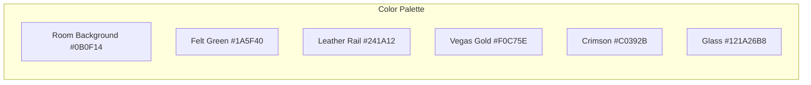
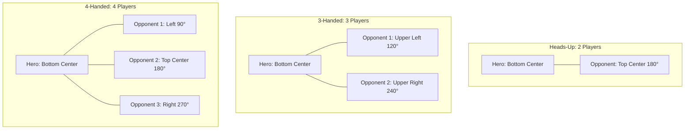
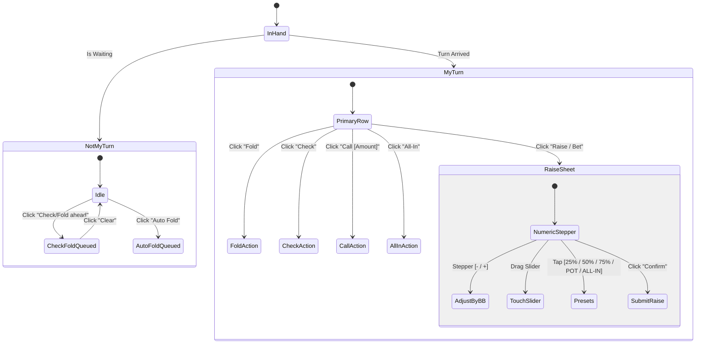
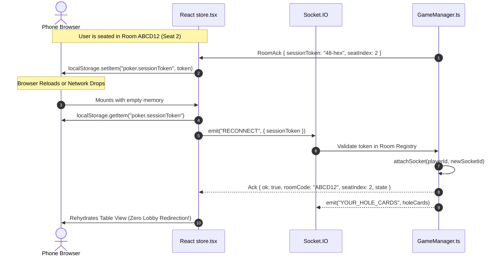

# Texas Hold'em Poker UI/UX Visual Architecture & Frontend Specification

This document provides a comprehensive technical breakdown of the UI/UX design system, mathematical geometry, component architecture, CSS layout pipelines, interaction flows, and session persistence for the Texas Hold'em Poker web client ([apps/web](file:///d:/poker-game-phase1/poker-game/apps/web)).

---

## Table of Contents
1. [Design System, Color Tokens & Aesthetic Foundations](#1-design-system-color-tokens--aesthetic-foundations)
2. [Component Architecture Map](#2-component-architecture-map)
3. [Table Geometry & Coordinate Mathematics](#3-table-geometry--coordinate-mathematics)
4. [Mobile Adaptive Layout Architecture](#4-mobile-adaptive-layout-architecture)
5. [Playing Card Rendering & Animation Pipeline](#5-playing-card-rendering--animation-pipeline)
6. [Player Badges, Avatars & Dynamic Turn Timers](#6-player-badges-avatars--dynamic-turn-timers)
7. [Action Dock & Interactive Raise Sheet](#7-action-dock--interactive-raise-sheet)
8. [Chip Stack Generation & Denomination Physics](#8-chip-stack-generation--denomination-physics)
9. [Showdown, Overlays & Celebration Engine](#9-showdown-overlays--celebration-engine)
10. [Lobby, Room Creation & Deep Linking](#10-lobby-room-creation--deep-linking)
11. [Audio, Turn Notifications & Accessibility](#11-audio-turn-notifications--accessibility)
12. [Session Persistence, Auto-Reconnection & State Rehydration](#12-session-persistence-auto-reconnection--state-rehydration)

---

## 1. Design System, Color Tokens & Aesthetic Foundations

The application uses a luxury casino dark aesthetic combining deep felt greens, rich saddle leather, brushed gold accents, and multi-layered glassmorphism.



### 1.1 Color Tokens ([tailwind.config.ts](file:///d:/poker-game-phase1/poker-game/apps/web/tailwind.config.ts))

| Token | Hex / Value | Semantic Role |
| :--- | :--- | :--- |
| `bg-room` | `#0B0F14` | Global viewport canvas with radial ambient lighting |
| `felt` | `#1A5F40` | Center poker felt table surface |
| `rail` | `#241A12` | 3D bevelled leather armrest rail |
| `gold` | `#F0C75E` | Primary accent, chip values, winning pots, active highlights |
| `goldDim` | `#D8B36A` | Subdued gold borders and secondary chips |
| `crimson` | `#C0392B` | Fold action, All-In badges, critical timer alerts ($<5\text{s}$) |
| `panel` | `rgba(18, 26, 38, 0.72)` | Glassmorphic floating surfaces with backdrop blur |
| `panel2` | `rgba(12, 18, 28, 0.85)` | Elevated sub-panels and inset badge discs |

### 1.2 GPU-Accelerated Felt & Leather Surface Textures ([globals.css](file:///d:/poker-game-phase1/poker-game/apps/web/app/globals.css))
```css
/* Felt Texture: Multi-stop radial lighting with procedural SVG noise overlay */
.felt-surface {
  background: radial-gradient(ellipse at 50% 35%, #237a53 0%, #1a5f40 45%, #0f4029 100%);
  position: relative;
}
.felt-surface::after {
  content: "";
  position: absolute;
  inset: 0;
  border-radius: inherit;
  opacity: 0.14;
  pointer-events: none;
  background-image: url("data:image/svg+xml,%3Csvg xmlns='http://www.w3.org/2000/svg' width='160' height='160'%3E%3Cfilter id='n'%3E%3CfeTurbulence type='fractalNoise' baseFrequency='0.9' numOctaves='2'/%3E%3C/filter%3E%3Crect width='160' height='160' filter='url(%23n)' opacity='0.55'/%3E%3C/svg%3E");
}

/* 3D Leather Armrest Rail */
.rail-surface {
  background: linear-gradient(145deg, #3a2b1c 0%, #241a12 40%, #1a120c 100%);
  box-shadow:
    0 24px 60px rgba(0, 0, 0, 0.55),
    inset 0 2px 3px rgba(255, 214, 140, 0.18),
    inset 0 -3px 6px rgba(0, 0, 0, 0.6);
}

/* Gold Inset Table Trim */
.gold-ring {
  box-shadow:
    inset 0 0 0 2px rgba(240, 199, 94, 0.35),
    inset 0 0 60px rgba(0, 0, 0, 0.45);
}
```

---

## 2. Component Architecture Map

```
apps/web/
├── app/
│   ├── page.tsx               # Root view router (JoinScreen vs Table vs 29)
│   └── globals.css            # Texture definitions, keyframes, safe-area insets
├── components/
│   ├── poker/
│   │   ├── TableOval.tsx          # Desktop 16:9 Ellipse table with hero-centric dynamic seating
│   │   ├── MobileTable.tsx        # Responsive viewport-locked mobile stage
│   │   ├── ActionBar.tsx          # Desktop action bar, stepper & pot presets
│   │   ├── MobileActionBar.tsx    # Mobile collapsed bar + slide-up raise sheet
│   │   ├── PlayerBadge.tsx        # Desktop player plate, avatar ring & chip stack
│   │   ├── CompactSeat.tsx        # Micro mobile seat unit with timer ring
│   │   ├── TimerRing.tsx          # SVG animated turn countdown ring
│   │   ├── ChipStack.tsx          # Multi-denomination physical chip stack
│   │   ├── WinnerBanner.tsx       # Showdown winner cards & payout banner
│   │   ├── Celebration.tsx        # Monster hand (Royal/Quads) radial takeover
│   │   ├── HeaderBar.tsx          # Top bar, room code copy, sound & settings menu
│   │   ├── LeftSidebar.tsx        # Game info, personal stats & loan summary
│   │   ├── RightSidebar.tsx       # Street timeline, recent hands & roster
│   │   ├── InfoSheet.tsx          # Mobile bottom sheet housing sidebars
│   │   ├── LoanModals.tsx         # Loan request approval & repayment dialogs
│   │   └── HandRankingsModal.tsx  # 1-10 Hand ranking guide
│   ├── common/
│   │   ├── PlayingCard.tsx        # Pure CSS/DOM high-DPI card component
│   │   ├── SeatAvatar.tsx         # Circular picture avatar with fallback disc
│   │   └── seatHues.ts            # Deterministic color hashing for names
│   └── join/
│       ├── JoinScreen.tsx         # Hero landing screen with ambient floating cards
│       ├── AvatarStrip.tsx        # Horizontal avatar picture selector
│       ├── CodeBoxes.tsx          # 6-character room code input boxes
│       └── CreateForm.tsx         # Table configuration steppers & presets
└── lib/
    ├── store.tsx              # Game state store, socket listeners, actions & sound
    ├── sound.ts               # Web Audio API synthesizers (chips, deal, win, turn)
    ├── notify.ts              # Tab title flashing, notification API & vibration
    └── celebrations.ts        # Canvas-confetti physics wrapper
```

---

## 3. Table Geometry & Coordinate Mathematics ([TableOval.tsx](file:///d:/poker-game-phase1/poker-game/apps/web/components/poker/TableOval.tsx))

### 3.1 Hero-Centric Dynamic Compaction & Even Spacing
Rather than dividing the ellipse into a fixed 10 slots (which produces lopsided clustering and large empty voids when 2 to 9 players are seated), the desktop oval employs a **Dynamic Active Seat Compaction Algorithm**:

1. **Hero Anchor**: The active player ("Hero") is permanently anchored at **bottom-center** ($\theta = 0$, $x=50\%, y=88\%$).
2. **Clockwise Active Opponent Ordering**: All currently occupied opponent seats are gathered in clockwise sequence starting immediately after Hero:
   $$\text{Opponents} = [s_{\text{first}}, s_{\text{second}}, \dots, s_K] \quad \text{where } K = \text{number of seated opponents}$$
3. **Equidistant Angular Partitioning**: The $K$ opponents are evenly spaced along the remaining perimeter arc with angle $\theta_i$ for $i \in [0, K-1]$:
   $$\text{TotalSlots} = K + 1$$
   $$\theta_i = \left( \frac{i + 1}{\text{TotalSlots}} \right) \cdot 2\pi$$
4. **Parametric Ellipse Transformation**:
   $$\text{left}_i = 50 - \sin(\theta_i) \cdot 42\%$$
   $$\text{top}_i = 50 + \cos(\theta_i) \cdot 38\%$$



### 3.2 Dynamic Seating Layout Map Across Player Counts

| Seated Count | Hero Position | Opponents Configuration | Visual Symmetry |
| :--- | :--- | :--- | :--- |
| **Heads-Up (2)** | Bottom Center ($0^\circ$) | $1$ Opponent at Top Center ($180^\circ$) | Direct vertical duel |
| **3-Handed (3)** | Bottom Center ($0^\circ$) | $2$ Opponents at Upper-Left ($120^\circ$) and Upper-Right ($240^\circ$) | Equilateral triangle |
| **4-Handed (4)** | Bottom Center ($0^\circ$) | $3$ Opponents at Left ($90^\circ$), Top ($180^\circ$), Right ($270^\circ$) | Symmetrical diamond |
| **6-Handed (6)** | Bottom Center ($0^\circ$) | $5$ Opponents at $60^\circ, 120^\circ, 180^\circ, 240^\circ, 300^\circ$ | Classic 6-max ring |
| **Full Ring (10)** | Bottom Center ($0^\circ$) | $9$ Opponents spaced every $36^\circ$ around the oval | Complete full-table ellipse |

### 3.3 Dynamic Dealer Button Coordinate Vector
The Dealer button (`D`) dynamically anchors directly in front of the active dealer's resolved table position using a centering vector ($f = 0.58$):
$$\vec{P}_{\text{dealer}} = \vec{P}_{\text{seat}} + \left( (50\%, 50\%) - \vec{P}_{\text{seat}} \right) \cdot 0.58$$

```typescript
function towardCenter(pos: { left: string; top: string }, f: number) {
  return {
    left: `${parseFloat(pos.left) + (50 - parseFloat(pos.left)) * f}%`,
    top: `${parseFloat(pos.top) + (50 - parseFloat(pos.top)) * f}%`,
  };
}
```

---

## 4. Mobile Adaptive Layout Architecture ([MobileTable.tsx](file:///d:/poker-game-phase1/poker-game/apps/web/components/poker/MobileTable.tsx))

Rather than shrinking the desktop ellipse (which makes text unreadable on phones), the mobile client employs a **Viewport-Locked Adaptive Stage**.

```
+--------------------------------------------------------+
|                      HEADER BAR                        |
+--------------------------------------------------------+
|  [Opponent TL]        [Opponent TM]      [Opponent TR] |
+--------------------------------------------------------+
| [Side L]          +------------------+        [Side R] |
|                   |    POKER FELT    |                 |
|                   |  Pot: 1,400 gold |                 |
|                   |  [Kd] [Qd] [Jd]  |                 |
|                   +------------------+                 |
+--------------------------------------------------------+
|           [Hero Seat]     [Hero Hole Cards]            |
|              (You)            [As] [10s]               |
+--------------------------------------------------------+
|          ACTION DOCK: [FOLD] [CALL 50] [RAISE]         |
+--------------------------------------------------------+
```

### 4.1 Opponent Slot Distribution Plan Matrix
Opponents are assigned to predefined spatial zones based on active count:

```typescript
type SlotId = "TL" | "TM" | "TR" | "SLU" | "SLD" | "SRU" | "SRD" | "CL" | "CR";

const PLANS: Record<number, { top: SlotId[]; left: SlotId[]; right: SlotId[]; corners: SlotId[] }> = {
  1: { top: ["TM"], left: [], right: [], corners: [] },
  2: { top: ["TL", "TR"], left: [], right: [], corners: [] },
  3: { top: ["TL", "TM", "TR"], left: [], right: [], corners: [] },
  4: { top: ["TL", "TR"], left: ["SLU"], right: ["SRU"], corners: [] },
  5: { top: ["TL", "TM", "TR"], left: ["SLU"], right: ["SRU"], corners: [] },
  6: { top: ["TL", "TR"], left: ["SLU", "SLD"], right: ["SRU", "SRD"], corners: [] },
  7: { top: ["TL", "TM", "TR"], left: ["SLU", "SLD"], right: ["SRU", "SRD"], corners: [] },
  8: { top: ["TL", "TR"], left: ["SLU", "SLD"], right: ["SRU", "SRD"], corners: ["CL", "CR"] },
  9: { top: ["TL", "TM", "TR"], left: ["SLU", "SLD"], right: ["SRU", "SRD"], corners: ["CL", "CR"] },
};
```

---

## 5. Playing Card Rendering & Animation Pipeline ([PlayingCard.tsx](file:///d:/poker-game-phase1/poker-game/apps/web/components/common/PlayingCard.tsx))

Cards are rendered entirely via pure CSS/DOM gradients and typography, guaranteeing razor-sharp rendering at any screen DPI.

```
+-------------------+
| A                 |  <- Top-Left Rank & Suit
| ♠                 |
|                   |
|         ♠         |  <- Oversized Centered Suit Glyph (1.7em)
|                   |
|                 ♠ |
|                 A |  <- Rotated 180° Index (Hidden on 'xs' size)
+-------------------+
```

### 5.1 Card Size Scale
```typescript
export const SIZES = {
  xs: "w-8 h-11 text-[10px] rounded-md",                               // Roster & Showdown
  sm: "w-11 h-16 text-sm rounded-lg",                                  // Mobile Board Cards
  md: "w-14 h-20 text-base rounded-xl",                                // Hero Hole Cards
  lg: "w-[clamp(52px,9vw,76px)] h-[clamp(74px,13vw,108px)] text-lg rounded-xl", // Desktop Community
} as const;
```

### 5.2 Keyframe Animations ([tailwind.config.ts](file:///d:/poker-game-phase1/poker-game/apps/web/tailwind.config.ts))
- **Card Deal (`animate-dealIn`)**: Translates down $-24\text{px}$, scales from $0.65 \to 1.0$, fades in from $0 \to 1.0$, with staggered delay ($\text{delay} = i \times 110\text{ms}$).
- **Card Flip (`animate-flipY`)**: Rotates $180^\circ$ along the Y-axis using CSS `perspective: 600px; transform-style: preserve-3d;`.
- **Card Float (`animate-floatY`)**: Ambient sinusoidal drift on lobby cards ($\Delta y = \pm 12\text{px}, \Delta\theta = \pm 6^\circ$).

---

## 6. Player Badges, Avatars & Dynamic Turn Timers ([PlayerBadge.tsx](file:///d:/poker-game-phase1/poker-game/apps/web/components/poker/PlayerBadge.tsx), [TimerRing.tsx](file:///d:/poker-game-phase1/poker-game/apps/web/components/poker/TimerRing.tsx))

### 6.1 Dynamic Turn Ring SVG Geometry
The `TimerRing` calculates the remaining time fraction $f = \frac{\text{remainingMs}}{\text{totalMs}}$ and binds it to an SVG stroke dashoffset:

$$\text{Radius } r = 24\text{px}, \quad \text{Circumference } C = 2\pi r \approx 150.796\text{px}$$
$$\text{Stroke Dashoffset} = C \cdot (1 - f)$$

```tsx
<svg className="h-full w-full -rotate-90">
  <circle cx="28" cy="28" r="24" className="stroke-white/10" strokeWidth="3" fill="none" />
  <circle
    cx="28"
    cy="28"
    r="24"
    stroke={remainingMs < 5000 ? "#c0392b" : remainingMs < 10000 ? "#f59e0b" : "#f0c75e"}
    strokeWidth="3"
    strokeDasharray="150.796"
    strokeDashoffset={150.796 * (1 - fraction)}
    strokeLinecap="round"
    fill="none"
  />
</svg>
```

### 6.2 Urgency Color Transitions
- **Normal ($>10\text{s}$)**: Vegas Gold stroke `#f0c75e`, steady text.
- **Warning ($5\text{s} - 10\text{s}$)**: Amber stroke `#f59e0b`.
- **Urgent ($<5\text{s}$)**: Crimson stroke `#c0392b`, pulsing text alert (`animate-pulse`).

---

## 7. Action Dock & Interactive Raise Sheet ([ActionBar.tsx](file:///d:/poker-game-phase1/poker-game/apps/web/components/poker/ActionBar.tsx), [MobileActionBar.tsx](file:///d:/poker-game-phase1/poker-game/apps/web/components/poker/MobileActionBar.tsx))

### 7.1 Action Hierarchy & State Machine



### 7.2 Smart Pot Preset Mathematics
Preset bet sizing dynamically adapts whether opening the bet or raising over an opponent:

| Preset | When Opening (`currentBet === 0`) | When Raising (`currentBet > 0`) |
| :--- | :--- | :--- |
| **25%** | $\text{PotTotal} \times 0.25$ | — |
| **50%** | $\text{PotTotal} \times 0.50$ | $\text{currentBet} + (\text{PotTotal} + \text{callAmount}) \times 0.50$ |
| **75%** | $\text{PotTotal} \times 0.75$ | $\text{currentBet} + (\text{PotTotal} + \text{callAmount}) \times 0.75$ |
| **POT** | $\text{PotTotal} \times 1.00$ | $\text{currentBet} + (\text{PotTotal} + \text{callAmount}) \times 1.00$ |
| **ALL-IN** | `maxRaiseTo` | `maxRaiseTo` |

---

## 8. Chip Stack Generation & Denomination Physics ([ChipStack.tsx](file:///d:/poker-game-phase1/poker-game/apps/web/components/poker/ChipStack.tsx))

Amounts are decomposed into standard casino chip denominations and rendered as a 3D isometric stack:

```typescript
const DENOMS = [
  { v: 1000, color: "#D8B36A", ring: "#8A6F42" }, // Gold
  { v: 500,  color: "#7D5BA6", ring: "#4E3769" }, // Purple
  { v: 100,  color: "#2B2B2B", ring: "#111111" }, // Black
  { v: 25,   color: "#1D4E89", ring: "#12335A" }, // Blue
  { v: 10,   color: "#2E77AE", ring: "#1C4C74" }, // Cyan
  { v: 5,    color: "#C0392B", ring: "#7E2418" }, // Red
  { v: 1,    color: "#E5E5E5", ring: "#9A9A9A" }, // White
];
```

```
  (===)   <- 1,000 Chip (Gold)
 (=====)  <- 500 Chip (Purple)
(=======) <- 100 Chip (Black)
  2,350   <- Tabular Label
```

Each chip renders with an offset $\text{bottom} = i \times 3\text{px}$ and a pop-in spring animation (`animate-popChip`).

---

## 9. Showdown, Overlays & Celebration Engine

### 9.1 Showdown Overlay ([WinnerBanner.tsx](file:///d:/poker-game-phase1/poker-game/apps/web/components/poker/WinnerBanner.tsx))
- **Split-Pot Grouping**: Aggregates multi-pot earnings per player into a single consolidated row.
- **Winning Cards Reveal**: Renders the exact 5-card subset (`bestFive`) with animated staggered card flips.
- **Hand Descriptions**: Shared formatter displaying formal hand titles (e.g. `"Two Pair, Kings & Tens"` or `"Aces full of Sevens"`).

### 9.2 Monster Hand Celebration ([Celebration.tsx](file:///d:/poker-game-phase1/poker-game/apps/web/components/poker/Celebration.tsx))
When a player makes **Four of a Kind** or a **Royal Flush**:
1. Radial golden or purple gradient takeover triggers across the screen.
2. 3D header announces `"★ LEGENDARY ★ ROYAL FLUSH"`.
3. Multi-angle 2-burst confetti cannon fires using Canvas Confetti physics (`spread: 70`, `startVelocity: 45`).

---

## 10. Lobby, Room Creation & Deep Linking ([JoinScreen.tsx](file:///d:/poker-game-phase1/poker-game/apps/web/components/join/JoinScreen.tsx))

### 10.1 Split Hero & 3D Ambient Layer
- Desktop viewport displays a floating card layer with slow sinusoidal drift.
- Mini table felt preview displays sample cards dealing in real time.

### 10.2 Identity & Room Code Deep Linking
- **Local Persistence**: Usernames and avatar selections persist in `localStorage`.
- **Deep Linking**: `https://domain.com/?room=CODE` auto-populates the 6-character room boxes and selects the "Join" tab. Once seated, the URL query parameter is cleanly stripped via `history.replaceState`.

---

## 11. Audio, Turn Notifications & Accessibility

### 11.1 Synthesized Web Audio API ([sound.ts](file:///d:/poker-game-phase1/poker-game/apps/web/lib/sound.ts))
No external audio files are required; sound effects are synthesized on demand via the browser `AudioContext`:
- **Chips Sound**: Multi-frequency click burst with randomized pitch ($1800\text{Hz} - 2800\text{Hz}$).
- **Turn Alert**: 2-tone melodic chime ($587.33\text{Hz} \to 880\text{Hz}$).
- **Win Fanfare**: 3-note ascending major arpeggio ($C_5 \to E_5 \to G_5$).

### 11.2 Multi-Channel Turn Alerts ([notify.ts](file:///d:/poker-game-phase1/poker-game/apps/web/lib/notify.ts))
When action is on the user and the tab is blurred:
1. **Title Flash**: Alternates document title between `(🔔 YOUR TURN) Poker` and `Room [CODE]`.
2. **HTML5 Notification**: Dispatches browser desktop notification with vibration pattern `[120, 80, 120]`.
3. Auto-disarms the moment the user acts or their turn ends.

---

## 12. Session Persistence, Auto-Reconnection & State Rehydration

When a player reloads their browser, closes a mobile tab, or experiences a network handover (e.g. Wi-Fi to cellular):



### 12.1 Client Storage Keys
- `poker.sessionToken`: 48-hex character cryptographic token generated by the server (`randomBytes(24).toString("hex")`).
- `poker.roomCode`: 6-character room code.
- `poker.username`: User's player handle.
- `poker.avatar`: User's selected avatar picture (1-10).

### 12.2 Automatic Socket Reconnection Lifecycle ([store.tsx](file:///d:/poker-game-phase1/poker-game/apps/web/lib/store.tsx))
```typescript
useEffect(() => {
  if (status !== "online") return;
  const token = typeof window !== "undefined" ? localStorage.getItem(TOKEN_KEY) : null;
  if (!token || me) return;
  const s = socketRef.current;
  if (!s) return;
  s.emit("RECONNECT", { sessionToken: token }, (ack) => {
    if (ack.ok && ack.roomCode) {
      setMe({
        roomCode: ack.roomCode,
        seatIndex: ack.seatIndex!,
        sessionToken: token,
        config: ack.config,
      });
      setState(ack.state ?? null);
    } else {
      localStorage.removeItem(TOKEN_KEY);
      localStorage.removeItem(ROOM_KEY);
    }
  });
}, [status, me]);
```

### 12.3 Offline UX & Visual States
- **Reconnecting Banner**: Displays non-blocking amber banner (`Connection lost — reconnecting to server...`) without unmounting table elements.
- **Seat Avatar Dimming**: When opponents temporarily drop their socket, their avatar disc dims to `opacity-40` with an `"offline"` badge, while preserving their active hand, bets, and pot eligibility.
- **Immediate Recovery**: As soon as the socket reconnects, the table state and private hole cards rehydrate instantly without interrupting the game.

---

*File generated for UI/UX visual architecture and frontend specification.*
